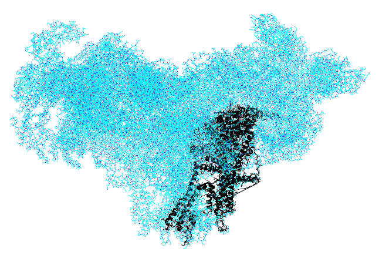

# ryr1
Ryanodine Receptor is a Ca+2 channel involved in skeletal muscle excitation and contraction.

Here, we are calculating the energy landscapes using MCCE. Calculations are done on two datasets.  One with the RyR1 macromolecules in equilibrium with a thermal bath without any activating ligands and the other in equilibrium with both a thermal bath and a reservoir of ligands, specifically calcium, ATP, and caffeine. This pooling of data allows both species to be described in terms of the same set of mutually orthogonal conformational coordinates.

## ligand_binding_sites:
These PDB files were prepared by Danya Ben Hail.  There are 50 files labeled frame_01 to frame_50.  In this dataset the structure is changed to give us only the residues that are near the binding site. In every frame directory, there is an input pdb (in black)

The output files are head3.lst and fort.38. 
## head3.lst
* iConf:conformer ID
* CONFORMER: conformer name
* FL: flag| f means the conformer is on, t means the conformer is off.
* occ: occupancy
* crg: charge
* Em0: Em in solution
* pKa0: pka in solution
* ne: # of electrons
* nH: # of protons
* vdw0: self vdW energy + implicit vdW energy (favorable) with solvent (water)
* vdw1:backbone vdW
* tors: torsion energy
* epol: backbone electrostatic interaction
* dsolv: desolvation energy 
* extra: extra energy term (This is the value we change when we want to calculate titration curve for the ligand)
* history: to keep track of the conformer

## fort.38
This file gives the occupancy of each conformer at differernt ph/eh/ch values.  In our case, we are using chemical titration (ch). The plot below shows the Ca+2 titration carve of frame01.
 

 
