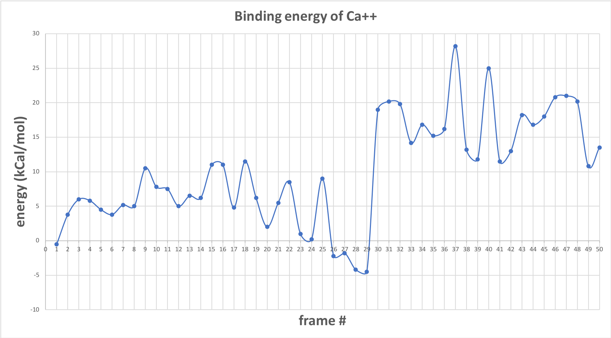

# ryr1
For an overview on the ryanodine receptor (RyR1) being a Ca+2 channel that facilitates skeletal muscle excitation and contraction, we can refer to this [paper](https://www.ncbi.nlm.nih.gov/pmc/articles/PMC5142848/).

Excellent reviews on ryanodine receptors [(RYRs)](https://www.ncbi.nlm.nih.gov/pmc/articles/PMC3156641/) , dihydropyridine receptors [(DHPRs)](https://www.ncbi.nlm.nih.gov/pubmed/19660468) and [Disease-causing mutations of calcium channels](https://www.tandfonline.com/doi/abs/10.4161/chan.2.3.5950).

In this project, we are calculating the energy landscapes using Multi-Conformer Continuum Electrostatics [(MCCE)](https://sites.google.com/site/mccewiki/home). Calculations are done with two datasets.  One set involves the RyR1 macromolecules in equilibrium with a thermal bath sans the activation of ligands; the other involves the RyR1 macromolecules in equilibrium with both a thermal bath as well as a reservoir of the activated ligands calcium, ATP, and caffeine. 

## testing/ligand_binding_sites:
These PDB files were prepared by Danya Ben Hail.  There are 50 files labeled frame_01 to frame_50.  The structure of this data set is modified such that only the activation core is calculated. Each frame_0i directory contains an input pdb, here highlighted in blue. 

Activation core top view | Activation core side view
------------ | -------------
 | 

**Figure 1:** Activation core (PDBID: 5t9r).  Residues B3614-B5102
The generated output files are titled head3.lst and fort.38. 

---

### All 50 frames
---
 
**Figure 2:** Binding energy (kCal/mol) data between Ca+2 and the activation core of ryr1

 
